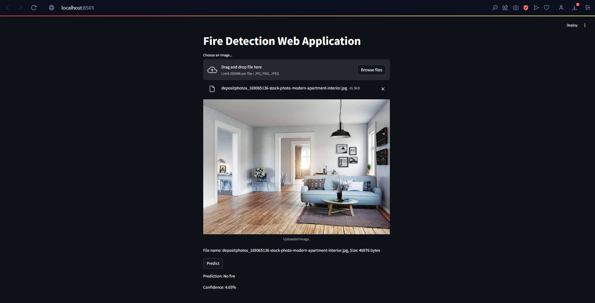
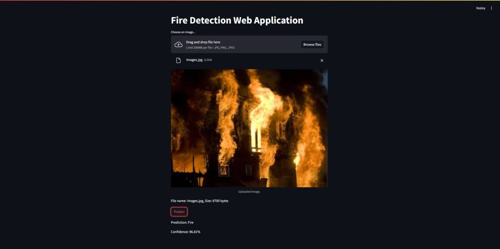

# Fire Detection Model Deployment

Hello! This is a test upload of a fire detection model on the website.

The model was trained to detect the presence of fire in images.

## Project Structure

The folder structure is as follows:
```
├── code
│   ├── datasets
│   │   └── data_fire  // This is where my dataset is stored. Folder `0` contains images without fire, and folder `1` contains images with fire.
│   ├── deployment
│   │   ├── api        // A copy of the model is stored here because Docker has limited visibility, so the model must be explicitly provided inside this directory.
│   │   └── app
│   └── models
│       └── smokeDetection.ipynb // Contains the Jupyter notebook for training the model and two images (one with fire, one without) for testing it.
├── data
└── models
    └── fire_detection_model  // This is where my trained model is stored.
```
## How to Run the Project

1. Navigate to the `code/deployment` directory.
2. Run the following command in your terminal:

   docker-compose up --build

## Example of Code in Action:

Below is a screenshot showing how the code works:



